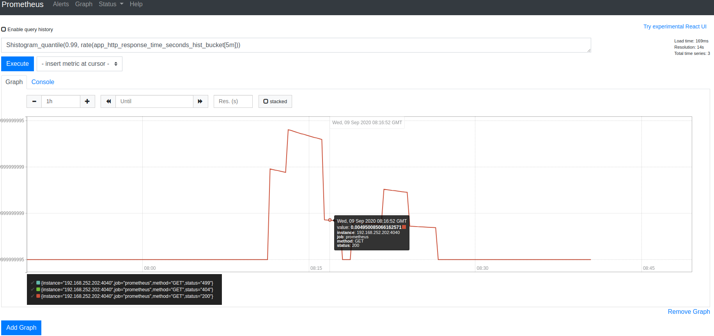
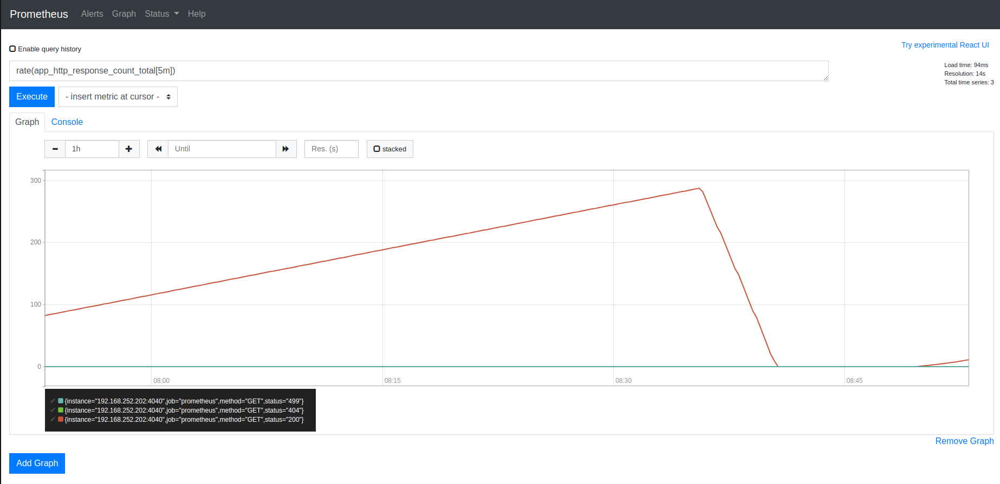

# mon

my_exporter.py - экспортер метрик
my_exporter.txt - пример экспортируемых метрик
sample.php - скрипт для нагрузочного тестирования
export.yml - конфигурационный файл для запуска докер-контейнера martinhelmich/prometheus-nginxlog-exporter 
load.yaml - конфигурационный файл для запуска генератор нагрузки yandex-tank

